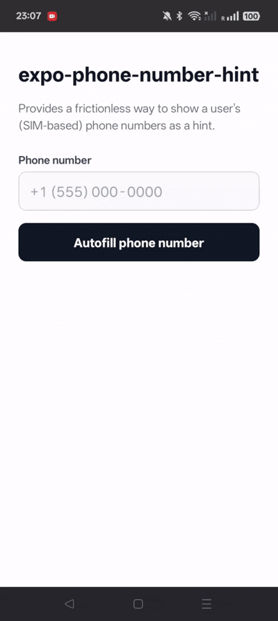

# expo-phone-number-hint

[](https://www.npmjs.com/package/expo-phone-number-hint)
[](https://github.com/shubh73/expo-phone-number-hint/actions/workflows/ci.yml)
[](LICENSE)

Provides a frictionless way to show a user's (SIM-based) phone numbers as a hint, powered by Google's [Phone Number Hint API](https://developer.android.com/identity/phone-number-hint).



## Installation

```
npx expo install expo-phone-number-hint
```

## Usage

```typescript
import {
  isAvailableAsync,
  showPhoneNumberHintAsync,
} from "expo-phone-number-hint";

const isAvailable = await isAvailableAsync();
if (isAvailable) {
  const result = await showPhoneNumberHintAsync();

  if (!result.canceled) {
    // user selected a number
    console.log(result.hint.number); // as returned by Play Services
    console.log(result.hint.e164); // "+919876543210" (or null if not derivable)
    console.log(result.hint.regionCode); // "IN" (or null)
  } else {
    // user dismissed the picker
  }
}
```

## API

### `isAvailableAsync()`

```typescript
function isAvailableAsync(): Promise<boolean>
```

Check whether the Phone Number Hint API can be used on this device. Never throws.

### `showPhoneNumberHintAsync()`

```typescript
function showPhoneNumberHintAsync(): Promise<PhoneNumberHintResult>
```

Shows the system phone number picker. Resolves to a result object:

```typescript
type PhoneNumberHintResult =
  | { canceled: false; hint: PhoneNumberHint }
  | { canceled: true; hint: null };

type PhoneNumberHint = {
  /** The verbatim string returned by Google Play Services. */
  number: string;
  /** E.164 (e.g. "+14155551234"), or null if not a valid phone number. */
  e164: string | null;
  /** ISO 3166-1 alpha-2 region of the active SIM, or null. */
  regionCode: string | null;
};
```

Google Play Services returns the number as stored on the device. `e164` is derived from `number` and `regionCode` as a best-effort convenience, validate it before use.

Throws an error with a `code` property on failure. See [Handling errors](#handling-errors) below.

### `formatToE164(number, regionCode?)`

```typescript
function formatToE164(number: string, regionCode?: string | null): string | null
```

Formats a phone number as E.164, validating it against the region's numbering rules. `regionCode` is an ISO 3166-1 alpha-2 code (e.g. `"US"`) used to interpret `number` when it does not include a country code; it can be omitted when `number` starts with `+`. Returns `null` if the number is not valid. Uses the `libphonenumber` implementation bundled with the Android OS, so it adds nothing to your app's bundle. On iOS and web, this returns `null`.

## Handling errors

All known codes are exported as `PhoneNumberHintErrorCodes`.

| Code | Meaning |
|------|---------|
| `ERR_PLAY_SERVICES_UNAVAILABLE` | Google Play Services is unavailable |
| `ERR_NO_HINT_AVAILABLE` | No phone number hints available |
| `ERR_NO_ACTIVITY` | No foreground activity |
| `ERR_LAUNCH_FAILED` | Failed to launch the picker |
| `ERR_EXTRACTION_FAILED` | Failed to extract phone number from result |
| `ERR_ALREADY_IN_PROGRESS` | Another request is already showing the picker |
| `ERR_MODULE_DESTROYED` | Module destroyed before result was delivered |
| `ERR_UNAVAILABLE` | Called on a platform where the picker is not available (iOS or web) |

## Play Services Auth version

Defaults to `com.google.android.gms:play-services-auth:21.5.1`. To override, set `playServicesAuthVersion` in your root `android/build.gradle`:

```gradle
ext {
  playServicesAuthVersion = "21.4.0"
}
```
